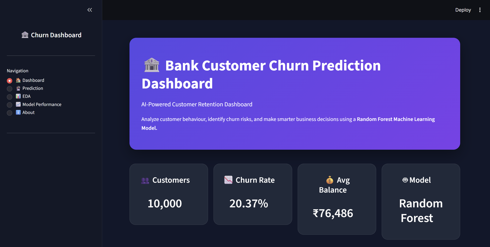
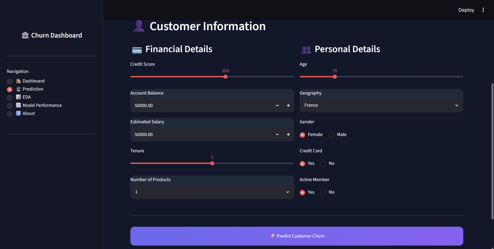
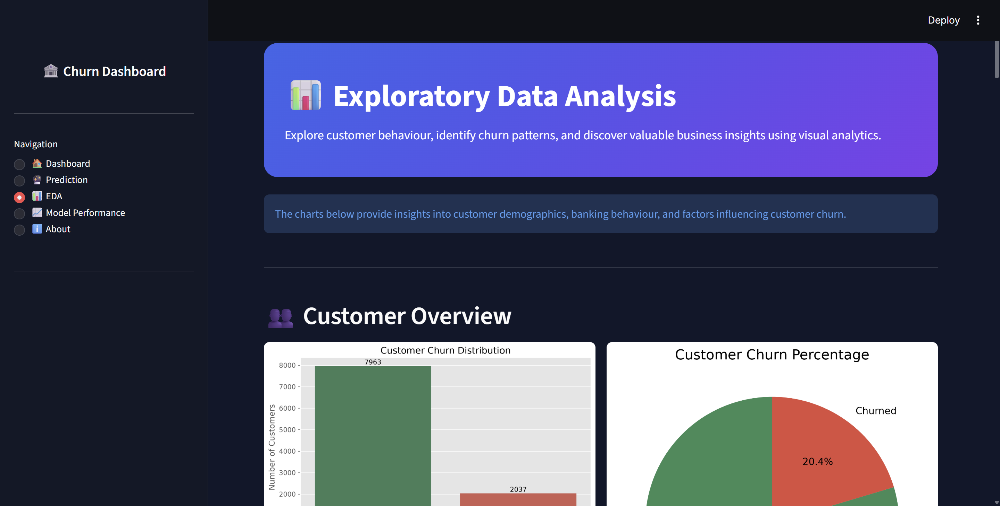
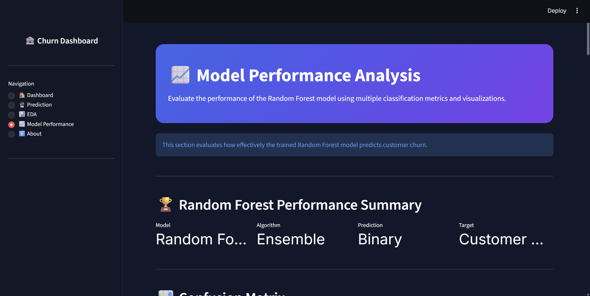
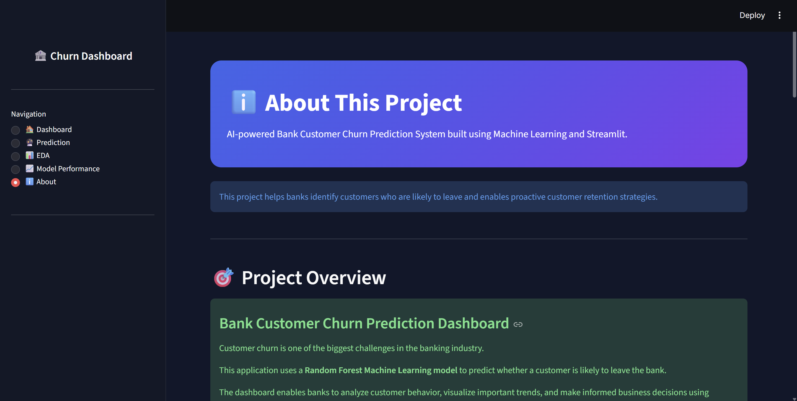

# 🏦 Bank Customer Churn Prediction Dashboard

### 🌐 Live Demo
**https://predictive-bank-analytics.streamlit.app/**

An interactive Machine Learning dashboard built using **Python**, **Streamlit**, and **Scikit-Learn** to predict customer churn in the banking sector.

The application helps identify customers who are likely to leave the bank, enabling businesses to take proactive customer retention actions through data-driven insights.

---

## 📌 Project Overview

Customer churn is one of the biggest challenges faced by banks. Losing existing customers increases acquisition costs and reduces long-term profitability.

This project leverages a **Random Forest Machine Learning Model** to predict whether a customer is likely to churn based on demographic, financial, and banking behavior features.

The application includes an interactive dashboard for business users, allowing them to:

- 📊 Explore customer data through visualizations
- 🔮 Predict customer churn
- 📈 Analyze customer behaviour
- 🤖 Evaluate machine learning performance
- 💡 Generate business insights for customer retention

---

## 🎯 Project Objectives

- Predict customer churn accurately using Machine Learning.
- Perform Exploratory Data Analysis (EDA).
- Compare multiple machine learning models.
- Visualize important business insights.
- Build an interactive dashboard using Streamlit.
- Support customer retention strategies through predictive analytics.

---

# ✨ Features

### 📊 Interactive Dashboard
- Business summary with key performance indicators (KPIs)
- Customer statistics and churn metrics
- Customer insights with visual analytics

### 🔮 Customer Churn Prediction
- Predict whether a customer is likely to churn
- Churn probability gauge
- Risk level classification (Low, Medium, High)
- Personalized business recommendations
- Download prediction report as CSV

### 📈 Exploratory Data Analysis (EDA)
- Customer churn distribution
- Age distribution
- Credit score distribution
- Geography analysis
- Gender analysis
- Balance distribution
- Salary distribution
- Correlation heatmap
- Feature-wise churn analysis

### 🤖 Model Performance Evaluation
- Confusion Matrix
- ROC Curve
- Precision-Recall Curve
- Feature Importance
- Model Comparison

### 💡 Business Insights
- Customer retention analysis
- High-risk customer identification
- Actionable business recommendations

---

# 🛠️ Tech Stack

| Category | Technologies |
|----------|--------------|
| Programming Language | Python |
| Web Framework | Streamlit |
| Machine Learning | Scikit-Learn |
| Data Processing | Pandas, NumPy |
| Data Visualization | Matplotlib, Seaborn, Plotly |
| Model Serialization | Joblib |
| Version Control | Git & GitHub |

---

# 🧠 Machine Learning Model

## Models Used

- Logistic Regression (Baseline)
- Decision Tree Classifier
- ✅ Random Forest Classifier (Final Model)

The Random Forest model was selected as the final model due to its strong predictive performance and robustness for customer churn classification.

---

# 📂 Project Structure

```
BANK-CUSTOMER-CHURN
│
├── app
│   ├── app.py
│   ├── styles.css
│   └── views
│       ├── dashboard.py
│       ├── prediction.py
│       ├── eda.py
│       ├── model_performance.py
│       └── about.py
│
├── data
│   ├── raw
│   │   └── European_Bank.csv
│   └── processed
│       └── processed_bank.csv
│
├── models
│   ├── decision_tree_model.pkl
│   ├── random_forest_model.pkl
│   └── scaler.pkl
│
├── notebooks
│   ├── 01_Business_Understanding.ipynb
│   ├── 02_EDA.ipynb
│   └── 03_Modeling.ipynb
│
├── outputs
│   └── figures
│
├── .streamlit
│   └── config.toml
│
├── README.md
├── requirements.txt
└── .gitignore
```

---

# 🚀 Installation

## 1. Clone the Repository

```bash
git clone https://github.com/Sanidhyacodes-03/Bank-Customer-Churn-Prediction
```

## 2. Navigate to the Project Folder

```bash
cd Bank-Customer-Churn
```

## 3. Create a Virtual Environment (Optional)

Windows

```bash
python -m venv .venv
```

Activate it

```bash
.venv\Scripts\activate
```

## 4. Install Dependencies

```bash
pip install -r requirements.txt
```

---

# ▶️ Run the Application

Start the Streamlit application using:

```bash
streamlit run app/app.py
```

The application will open automatically in your default web browser.

---

# 📊 Dataset

The project uses the **European Bank Customer Churn Dataset** containing customer demographic and financial information.

### Dataset Features

| Feature | Description |
|----------|-------------|
| CreditScore | Customer credit score |
| Geography | Customer country |
| Gender | Male / Female |
| Age | Customer age |
| Tenure | Years with the bank |
| Balance | Account balance |
| NumOfProducts | Number of bank products |
| HasCrCard | Credit card ownership |
| IsActiveMember | Active membership status |
| EstimatedSalary | Estimated annual salary |
| Exited | Target variable (Churn) |

---

# 🔄 Machine Learning Workflow

```
Business Understanding
        │
        ▼
Data Collection
        │
        ▼
Data Cleaning
        │
        ▼
Exploratory Data Analysis
        │
        ▼
Feature Engineering
        │
        ▼
Model Training
        │
        ▼
Model Evaluation
        │
        ▼
Customer Churn Prediction
```

---

# 📸 Application Screenshots

### 🏠 Dashboard



### 🔮 Prediction Page



### 📊 Exploratory Data Analysis



### 📈 Model Performance



### ℹ️ About Page


---

# 📈 Model Performance

The machine learning models were evaluated using multiple performance metrics.

### Evaluation Metrics

- ✅ Confusion Matrix
- ✅ ROC Curve
- ✅ Precision-Recall Curve
- ✅ Feature Importance
- ✅ Model Comparison

The **Random Forest Classifier** was selected as the final model due to its strong predictive performance and robustness in customer churn classification.

---

# 💡 Business Value

This application helps banks and financial institutions to:

- Identify customers who are at high risk of churn.
- Improve customer retention through proactive engagement.
- Support data-driven business decisions.
- Analyze customer behavior using interactive visualizations.
- Reduce customer acquisition costs by retaining existing customers.

---

# 🚀 Future Improvements

- Deploy the application to the cloud.
- Integrate with real-time banking databases.
- Add advanced machine learning models such as XGBoost and LightGBM.
- Implement customer segmentation and personalized recommendations.
- Build an automated customer retention recommendation system.

---

# 👨‍💻 Developer

**Sanidhya Singh Sisodiya**

### Skills

- Python
- Machine Learning
- Data Analytics
- Streamlit
- Scikit-Learn
- Pandas
- NumPy
- Matplotlib
- Seaborn
- Plotly
- Git & GitHub

---

# 📄 License

This project is intended for educational, learning, and portfolio purposes.

---

⭐ If you found this project useful, consider giving it a **star** on GitHub.
